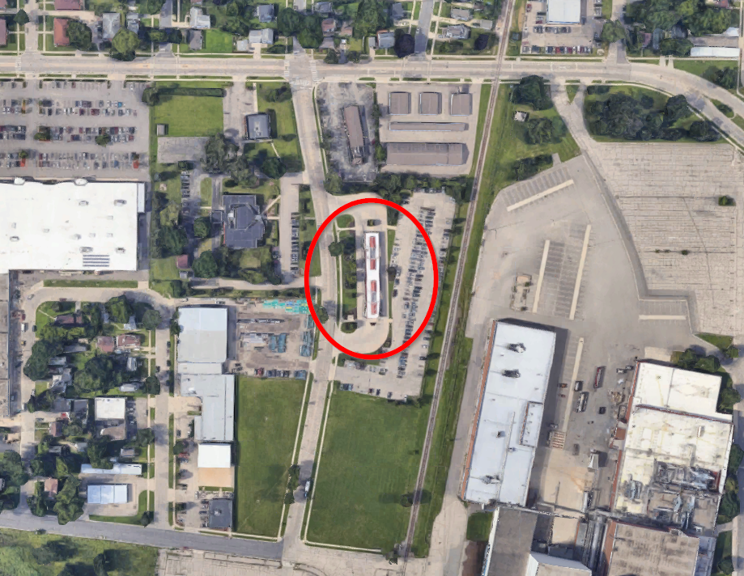

```{r setup, include=FALSE}
knitr::opts_chunk$set(echo = FALSE)
```

## Revision note 2022-03-07
*After the initial version of this post went up, Jonathan Mertzig pointed out that the number of departures per stop appeared to be wrong for at least one stop, Northern Lights & Epic Staff C (SB). In the post, the stop was listed with 30 departures, which is exactly twice as many as it actually has. I have identified what caused the issue and updated the post accordingly. If you notice any other errors, please let me know.*

```{r}
library(tidytransit)
library(tidyverse)
library(lubridate)
library(kableExtra)
```

Someone opened [a Github issue](https://github.com/vgXhc/metro_boardings/issues/1) on [my blog post about creating a map of bus boardings](https://haraldkliems.netlify.app/posts/bus-boardings-in-madison/):

> I know its kind of old but I was (re)visiting it in looking at the newest version of the redesign plan. It is difficult to compare ridership across stops when I know that some stops have more buses serving them than others. It would be cool to have ridership per bus or a similar measure. But I guess what we'd want is pre-pandemic frequencies. Is there even a source for old schedules were we to want to do it by hand?

I responded:

> To get the number of buses at each stop, you'd need 1) a pre-pandemic GTFS schedule file and 2) code to parse that data in the way you want. The former appears to be available via OpenMobilityData. For the latter, I'm not super proficient with GTFS data, but number of buses at a given stop I think is not that hard. \[...\] I'll see if I find some time to play around with the old GTFS file.

Fortunately, there is an R package for working with GTFS data, `tidytransit` [@poletti2022], and the package includes helpful [vignettes](https://cran.r-project.org/web/packages/tidytransit/vignettes/frequency.html). So I tried answering the question.

# Parsing pre-pandemic frequencies

The ridership data provided in my previous post uses a two-week sample from February 2020, right before the COVID-19 pandemic led to massive service reductions and ridership decline. To match the boarding with bus frequencies at that time, we download a GTFS feed from January 30, 2020 from the [OpenMobilityData portal](https://openmobilitydata.org/p/metro-transit-madison/181).

```{r}
gtfs <- read_gtfs("data/gtfs_metro_madison_2020-01-30.zip")
```

We start with a quick plot of the different service patterns in the first two months on 2020:

```{r}
library(lubridate)
jan_feb_2020 <- interval("2020-01-01", "2020-02-28")

gtfs$.$dates_services %>% 
  filter(date %within% jan_feb_2020) %>% 
  ggplot() + 
  theme_bw() + 
  geom_point(aes(x = date, y = service_id, color = wday(date, label = T)), size = 2)
```

We see that there are some services that run on some or all weekdays, some Saturday and Sunday and holiday services. We can also see that some services only run when the UW is in session/on break. Compared to the service pattern examples from the `tidytransit` vignettes, this is quite straightforward.

There is one exception to this straightforwardness: I realized that the final stop on a route gets counted as an additional departure. We can fix this by filtering out any stop time with a `drop_off_type` of 0 (i.e. passenger can only get off the bus).

```{r}
gtfs$stop_times <- gtfs$stop_times %>% 
  filter(drop_off_type == 0)
```


Rather than worrying about different service patterns, we therefore simply pick a typical weekday in February: February 17, a Wednesday, and get the number of departures frequency for each stop:

```{r}
stop_freq <- gtfs %>% 
  filter_feed_by_date("2020-02-17") %>% 
  get_stop_frequency(start_time = 0*3600, end_time = 24*3600, 
                              by_route = F)


stop_freq %>%
  head(10) %>% 
  kbl() %>% 
    kable_styling(bootstrap_options = c("striped", "hover"))

```

Now we can join the departure data with the locations of the bus stops and draw a map:

```{r}
library(tmap)
tmap_mode("view")

gtfs_shp <- gtfs %>% 
  gtfs_as_sf() 


stop_freq <- gtfs_shp$stops %>% 
  left_join(stop_freq, by = "stop_id") %>% 
  filter(n_departures >1) 

stop_freq %>% 
  tm_shape() +
  tm_dots(size = "n_departures", col = "n_departures", alpha = .7, popup.vars = c( "# daily departures" = "n_departures"), id = "stop_name")

```

We can  see the four transfer points; a cluster of stations with frequent service along the University Ave/Johnson St couplet, State St, and on the Capitol Square; and one busy quasi-transfer point at East Towne Mall.

# Combining frequency and boardings

Now all that remains is to join our frequency data with the boardings, and then divide the boarding count by the number of departures.

```{r}
library(sf)

boardings <- st_read("data/Metro_Transit_Ridership_by_Stop.shp")
```

Just as a reminder, this is what the raw boarding numbers look like on a map:

```{r}
boardings %>% 
  tm_shape() +
  tm_dots(col = "Weekday", size = "Weekday", alpha = .7)
```

Next, we join and create a map.

```{r}
boardings <- boardings %>% 
  mutate(stop_id = as.character(StopID)) %>% 
  st_drop_geometry()

stop_freq %>% 
  left_join(boardings, by = "stop_id") %>% 
  mutate(boardings_per_bus = Weekday/n_departures) %>% 
  tm_shape() +
  tm_dots(col = "boardings_per_bus", 
          size = "boardings_per_bus", 
          alpha = .7, 
          popup.vars = c("Boardings per departure" = "boardings_per_bus", "Weekday departures" = "n_departures", "Weekday boardings" = "Weekday"), 
          id = "stop_name",
          title = "Boardings per departure")

```

This map looks quite different: The transfer points lose some prominence, whereas the stops on the UW Campus really stand out. And out in Verona there is one very prominent stop. Let's look at the top 15 stops in a table.

```{r}
stop_freq %>% 
  left_join(boardings, by = "stop_id") %>% 
  mutate(boardings_per_bus = Weekday/n_departures) %>%
  st_drop_geometry() %>% 
  select(stop_name, boardings_per_bus, n_departures) %>% 
  arrange(desc(boardings_per_bus)) %>% 
  head(15) %>% 
  kableExtra::kbl(digits = 1, col.names = c("Stop name", "Boardings per bus", "Daily departures")) %>% 
  kable_styling(bootstrap_options = c("striped", "hover"))
```

The Observatory & Elm EB stop on average has on average 21 passengers boarding each bus. But the stop serving the Epic campus in Verona, with only 15 daily departures is really high up there as well. There are only a few other non-UW stops in the list: One serves the Madison College campus on the north side, and one is a Park & Ride lot; and two of the four transfer points made the cut.

# How to interpret these numbers?

What does it tell us that a high number of people board a bus at a given stop? Does it help make decisions for projects such as the [ongoing Network Redesign](https://www.cityofmadison.com/metro/routes-schedules/transit-network-redesign)? I'm curious what the person who initially asked the question thinks about this.

I can see two possible insights from the metric: A large number of people boarding at a stop leads to longer dwell times. [@fricker2011] It takes time for people to step on board, pay or validate their fare, and move through the vehicle, and so the bus will be stopped for a longer time. For schedule planning purposes it is therefore useful to have these numbers. Additionally, it may encourage an agency to think about improvements to vehicles serving such a stop or improving the stop itself: Buses with more doors, faster fare payment and validation, wider aisles, stops with level boarding. And finally, a high number of boardings per bus could indicate that a stop is underserved and needs more frequent buses!

An additional benefit of the metric is that it removes the prominence of the transfer points in the raw numbers. The four transfer points do not have much transit demand by themselves. This is aerial imagery of the North Transfer Point:



The reason for the high raw number of boardings is merely that the current route system is set up in a way that forces riders from outlying areas to transfer at the transfer points to get downtown or across town. That said, even after adjusting for the number of departures, the tranfers points still have a comparatively high number of boardings per bus.

